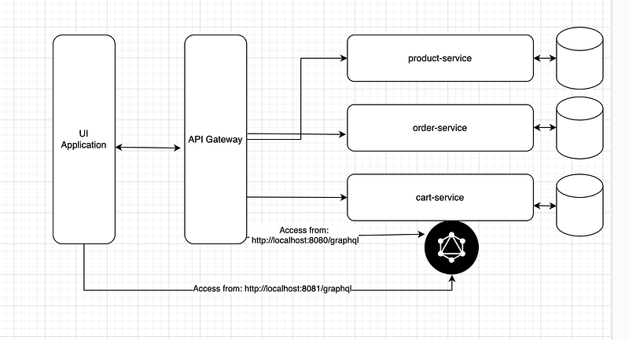
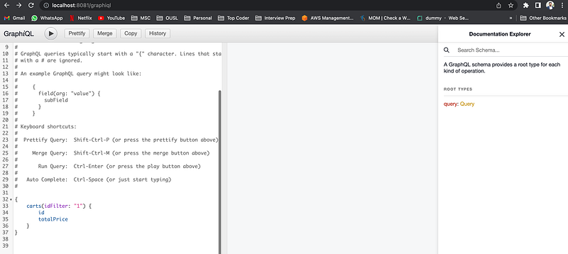
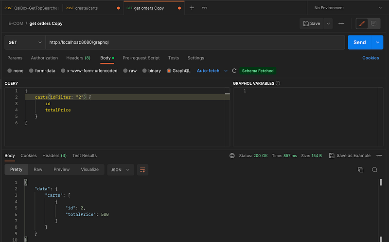

Hi Guys, In our last tutorial we saw how to use Kafka to connect product service and order service.

Now in this tutorial I’m going to follow another useful technique in micro services for data fetching. So up to now we have been creating Rest controllers and for the Cart service also if you have followed whole series up to now, you have been advised to create a Rest Controller. But in this tutorial for our learning purposes we are trying out graphQL instead of a Rest controller. For this I’m going to use Netflix DGS as it’s an easy solution for spring boot.

First of all let’s understand what is graphql. GraphQL is a query language and runtime for APIs that was developed by Facebook. It allows clients to request data from a server using a simple and efficient syntax that describes the data needed and the shape of the response. In GraphQL, the client sends a single request to the server specifying the data it needs and the structure of the response. The server responds with a JSON object that matches the shape of the request. This means that the client can get exactly the data it needs and nothing more, reducing the amount of over-fetching and under-fetching of data that can occur with traditional REST APIs. GraphQL also provides a strongly typed schema that defines the types of data available and the operations that can be performed on them. This allows for more accurate tooling and better developer experience when working with APIs.



First dependencies, Go to the cart-service and open the build.gradle file and make it similar to this.

```bash
plugins {
    id 'java'
    id 'org.springframework.boot' version '2.6.3'
    id 'io.spring.dependency-management' version '1.0.11.RELEASE'
}

group 'org.billa'
version '1.0-SNAPSHOT'

repositories {
    mavenCentral()
}

dependencies {
    implementation 'org.springframework.boot:spring-boot-starter:2.6.3'
    implementation 'org.springframework.boot:spring-boot-starter-web:2.6.3'
    implementation 'org.springframework.cloud:spring-cloud-starter-netflix-eureka-client:3.1.5'
    implementation 'org.springframework.boot:spring-boot-starter-data-jpa:2.1.5.RELEASE'
    implementation(platform("com.netflix.graphql.dgs:graphql-dgs-platform-dependencies:5.1.1"))
    implementation "com.netflix.graphql.dgs:graphql-dgs-spring-boot-starter:5.1.1"
    implementation 'org.postgresql:postgresql:42.5.4'
    testImplementation 'org.junit.jupiter:junit-jupiter-api:5.8.1'
    testRuntimeOnly 'org.junit.jupiter:junit-jupiter-engine:5.8.1'
}

test {
    useJUnitPlatform()
}
```

Now let’s create schema file needed by graphql. For this inside resources folder create a folder named schema and inside it create a file called schema.graphqls. Inside this file we define the Object we are querying and also the method we are using inside the Query. Simply graphql method carts(idFilter: String) will return a list of carts.

```bash
type Query {
    carts(idFilter: String): [Cart]
}

type Cart {
    id: Int
    totalPrice: Int
}
```

Next in the controllers folder create a file named CartDataFetcher and add following code.

```
package org.billa.controllers;

import com.netflix.graphql.dgs.DgsComponent;
import com.netflix.graphql.dgs.DgsQuery;
import com.netflix.graphql.dgs.InputArgument;
import org.billa.entities.Cart;
import org.billa.repositories.CartRepository;
import org.springframework.beans.factory.annotation.Autowired;

import java.util.List;
import java.util.Objects;
import java.util.stream.Collectors;

@DgsComponent
public class CartDataFetcher {
    @Autowired
    private CartRepository cartRepository;

    @DgsQuery
    public List<Cart> carts(@InputArgument Long idFilter) {
        if (idFilter == null) {
            return cartRepository.findAll();
        }

        return cartRepository.findAll().stream().filter(s -> (Objects.equals(s.getId(), idFilter))).collect(Collectors.toList());
    }
}
```

So what we are doing here is we get all the data related to carts and filter it using ID and then send results. There is no rest controller involved just graphql. All right now you just have to run your appication. A per the previous implementations this service runs on 8081 port. Now access the following URL from your browser. [http://localhost:8081/graphiql](http://localhost:8081/graphiql). You will see something like this.



If you click on the run button you will see the data in your carts table. If there is no data add data using postman. Now this is the interactive space to test our queries. But when calling from UI we need to map this to port 8080, which is our API Gateway. For this go to the application.properties file in the api-gateway service and change it like this.

```bash
server.port=8080
spring.application.name=api-gateway
eureka.client.service-url.default-zone=http://localhost:8761/eureka/

# Spring Cloud Gateway Configuration
spring.cloud.gateway.discovery.locator.enabled=true
spring.cloud.gateway.routes[0].id=product-service
spring.cloud.gateway.routes[0].uri=lb://product-service
spring.cloud.gateway.routes[0].predicates[0]=Path=/products/**
spring.cloud.gateway.routes[1].id=cart-service
spring.cloud.gateway.routes[1].uri=lb://cart-service
spring.cloud.gateway.routes[1].predicates[0]=Path=/carts/**
spring.cloud.gateway.routes[2].id=order-service
spring.cloud.gateway.routes[2].uri=lb://order-service
spring.cloud.gateway.routes[2].predicates[0]=Path=/orders/**
spring.cloud.gateway.routes[3].id=graphql
spring.cloud.gateway.routes[3].uri=lb://cart-service
spring.cloud.gateway.routes[3].predicates[0]=Path=/graphql/**
```


Now open Postman and write your query like this.



Great !!!, I think you are now capable of using GraphQL in spring boot apps. GraphQL has some amazing features to connect micro services, we will discuss them in future.

Happy Coding ;)

Github Link: [https://github.com/deBilla/e-commerce-ws](https://github.com/deBilla/e-commerce-ws)
