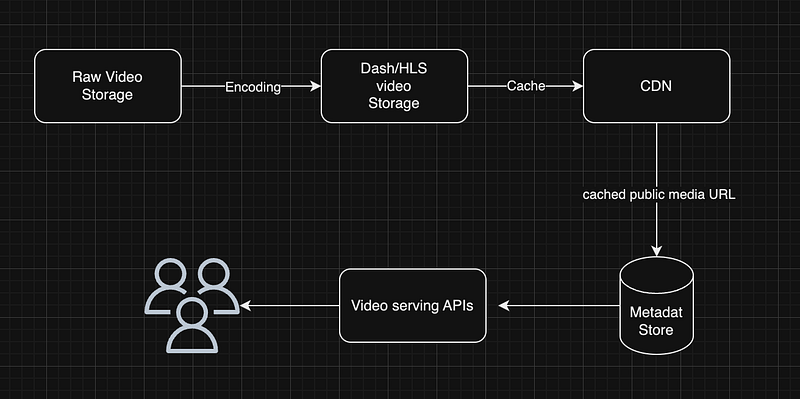

So when creating a video streaming platform, one of the most important things is video metadata. Users should have fast access to video metadata. Normally the video streaming flow for many companies is as follows.

Now you can see for video files we do not have to worry much if we have a good CDN and many of the APIs involved with user interfaces are querying video metadata. So it’s important have a database with good reading performances for metadata storage.

## Choosing between SQL and NOSQL

There are several factors to consider when choosing between SQL or NoSQL for metadata storage.

**SQL (Structured Query Language) Databases:**

- Structured Data: SQL databases are ideal for structured and well-defined data, making them a good choice for video metadata, which typically has a clear schema.
- ACID Compliance: SQL databases provide strong ACID (Atomicity, Consistency, Isolation, Durability) guarantees, ensuring data integrity, which is crucial for video metadata, especially in scenarios like digital asset management systems.
- Complex Queries: SQL databases excel at handling complex queries, which can be useful when you need to search and retrieve specific video metadata efficiently.
- Transactions: If your application requires transaction support (e.g., for updating metadata across multiple tables), SQL databases are a more natural fit.
- Maturity: SQL databases like PostgreSQL and MySQL have been around for a long time, offering a robust ecosystem of tools and libraries.

**NoSQL Databases:**

- Flexibility: NoSQL databases, especially document-based and key-value stores, offer greater flexibility in storing unstructured or semi-structured data. This can be advantageous if your video metadata schema evolves over time.
- Scalability: NoSQL databases, such as MongoDB and Cassandra, are known for their horizontal scalability, making them a good choice when dealing with large volumes of video metadata or high read/write loads.
- Schema Evolution: NoSQL databases allow for easier schema evolution, which can be helpful if your video metadata schema changes frequently.
- Semi-Structured Data: If your video metadata includes complex nested data structures or hierarchical data, NoSQL databases can handle this more naturally.
- Performance: NoSQL databases often excel in read-heavy, distributed, and low-latency scenarios, which may be relevant for serving video metadata in real-time.

In summary, when deciding between SQL and NoSQL for video metadata storage:

- **Choose SQL if your video metadata has a well-defined schema, requires strong data consistency and integrity, and involves complex queries or transactions.**
- **Choose NoSQL if your video metadata is semi-structured or evolving, you need horizontal scalability, or your use case emphasizes read-heavy, distributed, or low-latency operations.**

Only reason to go with SQL as of the above comparison is joins we have to do with user related data when querying. For example user play history, rate history etc.

## Choosing between SQL Joins or MongoDB population

So as the importance lying in database joins, as the next step let’s compare SQL joins and Mongo db population.

The read time cost comparison between Mongoose population and SQL joins depends on various factors, including the database technology, data model, indexing, and query complexity. Let’s compare the read time costs of Mongoose population and SQL joins under different scenarios:

**Mongoose Population:**

- **Use Case**: Mongoose population is typically used in NoSQL databases like MongoDB, where data is often denormalized, and relationships are established using references.
- **Performance Characteristics**:
 — Efficient for simple relationships with a limited number of references.
 — Generally performs well for shallow relationships and small datasets.
 — Read time cost remains relatively consistent regardless of the depth of the population (i.e., populating documents within documents).
- **Considerations**:
 — Population may become less efficient for complex queries, especially when dealing with deep nesting and the need to retrieve large sets of related documents.
 — Efficient indexing is crucial to mitigate read time costs.

**SQL Joins**:

- **Use Case**: SQL joins are used in relational databases (e.g., MySQL, PostgreSQL) where data is typically normalized into separate tables.

- **Performance Characteristics**:
 — SQL joins are optimized for retrieving data from normalized structures.
 — They are well-suited for complex queries involving multiple tables and large datasets.
 — Read time cost can vary based on indexing, query complexity, and the size of the dataset.

- **Considerations**:
 — SQL joins are highly efficient for complex querying and reporting involving multiple tables.
 — Proper indexing and query optimization are essential for optimal performance.

**Factors Affecting Read Time Costs**:

1. **Query Complexity**: The complexity of your query is a significant factor. Simple queries with limited joins or population typically have lower read time costs.

2. **Data Volume**: The size of your dataset can impact read time costs. Large datasets may experience slower reads, especially with complex queries.

3. **Indexes**: Properly indexed collections/tables can significantly improve read performance for both Mongoose population and SQL joins.

4. **Data Modeling**: The structure of your data and the choice between embedding documents or using references impact read time costs.

5. **Hardware and Resources**: The server’s hardware, including CPU and memory, can influence read performance, especially for complex operations.

**Summary**:

- **Mongoose population is suitable for simple relationships and small to medium-sized datasets, providing straightforward access to related data.**

**- SQL joins excel in complex querying scenarios, large datasets, and when dealing with normalized data structures.**

- **The choice between them depends on your database technology, data modeling decisions, and the complexity of your queries. Profiling and benchmarking with real data are essential to determine which approach offers better read time performance for your specific use case.**
