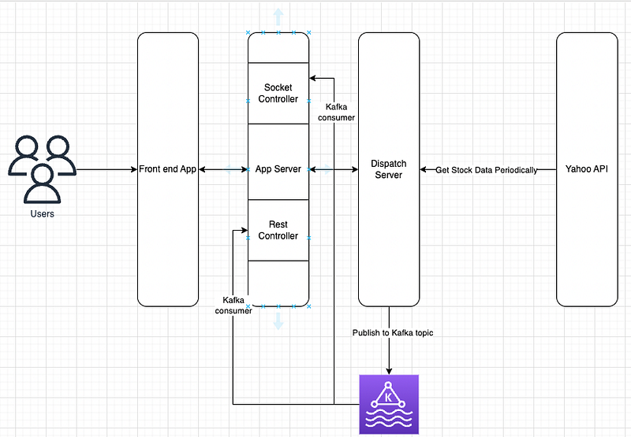

Hi Guys, I’m writing this article almost 2 years after I wrote the last tutorial for this series. If you go through the following link you will see we created a Spring boot app to take data from Yahoo API and then using a web socket we send that data to font end.

Now after 2 years while I was studying scalable technologies, I thought how that implementation would handle a large concurrent connections. For every web socket created, we would have to call Yahoo API and if there are large number of users and concurrent web sockets, although we scale up the servers, the number of request going to Yahoo API will increase. So I thought of adding another layer to our application. Now the high level architecture would like this.



Now what we are doing is, we take data from Yahoo API periodically and then publish those data to a Kafka topic. After that these data is consumed by 2 listeners (This is one of the best things about Kafka). One in Socket controller and other one is in the Rest controller. after that we store the stock data coming from kafka stream in array lists (Kind of like a in memory cache/ lookup table). Now whenever we access from RestAPI or Web socket, we will get the data in the array list.

All right, First thing is to run a Kafka server in our local environment. For this you have to go to this link and download the kafka server binary.

[https://downloads.apache.org/kafka/3.4.0/kafka_2.12-3.4.0.tgz](https://downloads.apache.org/kafka/3.4.0/kafka_2.12-3.4.0.tgz)

Now open this in your computer and inside the extracted folder run the following command. This will run on 2181 port.

```
bin/zookeeper-server-start.sh config/zookeeper.properties
```

Open another terminal while the above command is running and run the following command. This will run on 9092 port. This is the Kafka server but withou the one in 2181 port running this won’t work.

```
bin/kafka-server-start.sh config/server.properties
```

Next step is to create a Kafka topic for our app. Let’s name it as “stock-market-data”.

```
bin/kafka-console-consumer.sh --bootstrap-server localhost:9092 --topic stock-market-data --from-beginning
```

All right, now what we have to do is, we need to create the Dispatch server. I will create a service called DispatchServer. This will have method to connect to Kafka server. So we have to add necessary application.properties as well.

```
package com.billa.code.stockMarket.service;
import org.springframework.stereotype.Service;
import org.springframework.kafka.core.KafkaTemplate;

@Service
public class DispatchServer {
    private final KafkaTemplate<String, String> kafkaTemplate;

    public DispatchServer(KafkaTemplate<String, String> kafkaTemplate) {
        this.kafkaTemplate = kafkaTemplate;
    }

    public void publish(String data) {
        kafkaTemplate.send("stock-market-data",data);
    }
}
```

```
spring.kafka.bootstrap-servers=localhost:9092
spring.kafka.template.default-topic=stock-market-data
```

Now let’s modify the StockMarketApplication class to run this server along with our app server. We create a timer scheduler to get stock data from yahoo api every 30 sec and publish it to Kafka stream. When writing the object we write it as a JSON string.

```
package com.billa.code.stockMarket;

import com.billa.code.stockMarket.model.StockResponseModel;
import com.billa.code.stockMarket.service.DispatchServer;
import com.billa.code.stockMarket.service.StockService;
import com.fasterxml.jackson.core.JsonProcessingException;
import com.fasterxml.jackson.databind.ObjectMapper;
import org.springframework.beans.factory.annotation.Autowired;
import org.springframework.boot.CommandLineRunner;
import org.springframework.boot.SpringApplication;
import org.springframework.boot.autoconfigure.SpringBootApplication;
import org.springframework.kafka.annotation.KafkaListener;
import yahoofinance.Stock;

import java.math.BigDecimal;
import java.util.ArrayList;
import java.util.List;
import java.util.Timer;
import java.util.TimerTask;

@SpringBootApplication
public class StockMarketApplication implements CommandLineRunner {
    private final DispatchServer dispatchServer;

    @Autowired
    StockService stockService;

    public StockMarketApplication(DispatchServer dispatchServer) {
        this.dispatchServer = dispatchServer;
    }

    public static void main(String[] args) {
        SpringApplication.run(StockMarketApplication.class, args);
    }

    @Override
    public void run(String... args) throws Exception {
        Timer timer = new Timer();
        timer.schedule(new TimerTask() {
            @Override
            public void run() {
                StockResponseModel stock = stockService.getStockResponse();
                ObjectMapper objectMapper = new ObjectMapper();
                try {
                    String json = objectMapper.writeValueAsString(stock);
                    dispatchServer.publish(json);
                } catch (JsonProcessingException e) {
                    throw new RuntimeException(e);
                }
            }
        }, 0, 1000 * 30); // Schedule the task to run every 1 second
    }
}
```

Now let’s add the Kafka listener in the SocketController.java. Here inside our socket which is sending data to front end every 2 sec after being connected would send the details in the array list “stocks”. We are adding data coming from kafka listener to this list. When we are consuming we convert the JSON string back to an object array. There will be an error when you do this saying there is no default constructor in StockModel. You will have to change that file as well.

```
package com.billa.code.stockMarket.controller;
import com.billa.code.stockMarket.model.StockResponseModel;
import com.billa.code.stockMarket.service.StockService;
import com.fasterxml.jackson.core.JsonProcessingException;
import com.fasterxml.jackson.databind.ObjectMapper;
import org.springframework.beans.factory.annotation.Autowired;
import org.springframework.kafka.annotation.KafkaListener;
import org.springframework.messaging.handler.annotation.MessageMapping;
import org.springframework.messaging.simp.SimpMessagingTemplate;
import org.springframework.stereotype.Controller;

import java.util.ArrayList;
import java.util.List;
import java.util.concurrent.Executors;
import java.util.concurrent.ScheduledExecutorService;
import static java.util.concurrent.TimeUnit.SECONDS;

@Controller
public class SocketController {
    @Autowired
    SimpMessagingTemplate template;

    private final List<StockResponseModel> stocks = new ArrayList<>();

    private static final ScheduledExecutorService scheduler = Executors.newScheduledThreadPool(10);

    @MessageMapping("/hello")
    public void greeting() {
        scheduler.scheduleAtFixedRate(() -> {
            template.convertAndSend("/topic/message", stocks);
        }, 0, 2, SECONDS);
    }

    @KafkaListener(topics = "stock-market-data", groupId = "group-2")
    public void listen(String message) {
        ObjectMapper objectMapper = new ObjectMapper();
        try {
            StockResponseModel stockResponseModel = objectMapper.readValue(message, StockResponseModel.class);
            stocks.clear();
            stocks.add(stockResponseModel);
            System.out.println("Received Messasge in group - group-id: " + stockResponseModel);
        } catch (JsonProcessingException e) {
            throw new RuntimeException(e);
        }
    }
}
```

Next will do the same in StockController. But here if you can see I have changed the group-id. Group id differentiate consumers, if it’s same only one consumer will consume, if its different both will consume.

```
package com.billa.code.stockMarket.controller;

import com.billa.code.stockMarket.model.StockResponseModel;
import com.fasterxml.jackson.core.JsonProcessingException;
import com.fasterxml.jackson.databind.ObjectMapper;
import org.springframework.boot.autoconfigure.EnableAutoConfiguration;
import org.springframework.http.MediaType;
import org.springframework.kafka.annotation.KafkaListener;
import org.springframework.web.bind.annotation.*;

import java.util.ArrayList;
import java.util.List;

@RestController
@EnableAutoConfiguration
public class StockController {
    private final List<StockResponseModel> stocks = new ArrayList<>();

    @CrossOrigin(origins = "*")
    @GetMapping(value="/getStock", produces= MediaType.APPLICATION_JSON_VALUE)
    List<StockResponseModel> getStocks() {
        return stocks;
    }

    @KafkaListener(topics = "stock-market-data", groupId = "group-3")
    public void listen(String message) {
        ObjectMapper objectMapper = new ObjectMapper();
        try {
            StockResponseModel stockResponseModel = objectMapper.readValue(message, StockResponseModel.class);
            stocks.clear();
            stocks.add(stockResponseModel);
            System.out.println("Received Messasge in group - group-id: " + stockResponseModel);
        } catch (JsonProcessingException e) {
            throw new RuntimeException(e);
        }
    }
}
```

To test the Web socket I have created a simple HTML file, feel free to use it.

```
<!DOCTYPE html>
<html>
  <head>
    <title>Hello WebSocket</title>
    <script src="https://code.jquery.com/jquery-3.6.0.min.js"></script>
    <script src="https://cdn.jsdelivr.net/npm/sockjs-client@1/dist/sockjs.min.js"></script>
    <script
      src="https://cdnjs.cloudflare.com/ajax/libs/stomp.js/2.3.3/stomp.min.js"
      integrity="sha512-iKDtgDyTHjAitUDdLljGhenhPwrbBfqTKWO1mkhSFH3A7blITC9MhYon6SjnMhp4o0rADGw9yAC6EW4t5a4K3g=="
      crossorigin="anonymous"
      referrerpolicy="no-referrer"
    ></script>
    <script>
      var stompClient = null;

      function setConnected(connected) {
        $("#connect").prop("disabled", connected);
        $("#disconnect").prop("disabled", !connected);
        if (connected) {
          $("#conversation").show();
        } else {
          $("#conversation").hide();
        }
        $("#greetings").html("");
      }

      function connect() {
        var socket = new SockJS("http://localhost:8080/ws-message");
        stompClient = Stomp.over(socket);
        stompClient.connect({}, function (frame) {
          setConnected(true);
          console.log("Connected: " + frame);
          stompClient.subscribe("/topic/message", function (greeting) {
            showGreeting(JSON.parse(greeting.body));
          });
        });
      }

      function disconnect() {
        if (stompClient !== null) {
          stompClient.disconnect();
        }
        setConnected(false);
        console.log("Disconnected");
      }

      function sendName() {
        stompClient.send(
          "/app/hello",
          {},
          JSON.stringify({ name: $("#name").val() })
        );
      }

      function showGreeting(message) {
        let res = message[0];
        $("#greetings").append("<tr><td>" + res.stockExg + " - " + res.stock[0].name + " - " + res.stock[0].price + "</td></tr>");
      }

      $(function () {
        $("form").on("submit", function (e) {
          e.preventDefault();
        });
        $("#connect").click(function () {
          connect();
        });
        $("#disconnect").click(function () {
          disconnect();
        });
        $("#send").click(function () {
          sendName();
        });
      });
    </script>
  </head>
  <body>
    <noscript
      ><h2 style="color: #ff0000">
        Seems your browser doesn't support Javascript! Websocket relies on
        Javascript being enabled. Please enable Javascript and reload this page!
      </h2></noscript
    >
    <div id="main-content" class="container">
      <div class="row">
        <div class="col-md-6">
          <form class="form-inline">
            <div class="form-group">
              <label for="connect">WebSocket connection:</label>
              <button id="connect" class="btn btn-default" type="submit">
                Connect
              </button>
              <button
                id="disconnect"
                class="btn btn-default"
                type="submit"
                disabled="disabled"
              >
                Disconnect
              </button>
            </div>
          </form>
        </div>
        <div class="col-md-6">
          <form class="form-inline">
            <div class="form-group">
              <label for="name">What is your name?</label>
              <input
                type="text"
                id="name"
                class="form-control"
                placeholder="Your name here..."
              />
            </div>
            <button id="send" class="btn btn-default" type="submit">
              Send
            </button>
          </form>
        </div>
      </div>
      <div class="row">
        <div class="col-md-12">
          <table id="conversation" class="table table-striped">
            <thead>
              <tr>
                <th>Greetings</th>
              </tr>
            </thead>
            <tbody id="greetings"></tbody>
          </table>
        </div>
      </div>
    </div>
  </body>
</html>
```

Ok. That’s all for this tutorial. Hope you learn something. Happy Coding ;) As usual code can be found in following link
