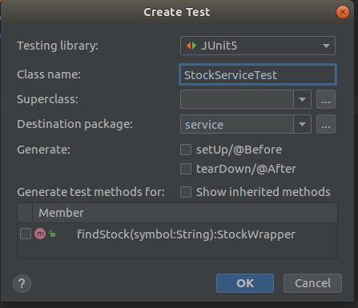

Hi guys. So up to now we have developed a basic spring boot app which gets data from Yahoo finance API and show the stock price. So in this tutorial i’m just going to touch the unit testing area a little bit because when you work for a big tech company these practices comes handy. So here in this tutorial i will be using JUnit for unit testing. So if you look at the gradle.build file i have already shown you guys, It includes JUnit dependencies. So lets dive directly in to a test scenario in our code. Tutorials up to now in this series,

So the other day we created a service to get Stock data from Yahoo fiance API. So i will be adding unit tests for that file. Guys i’m not here to go deeply in to basics and make this tutorial boring. So i will show you the easy way to create a test file using intellij. Go to the StockService.java file and then right click inside the class. In the popup you will see a tab called “Generate” click on it. There you will find a tab called Test and click on it. So you will get a dialog box like this.



So here you can see its asking us for which methods we need unit tests. As we have only one method we are going to write the unit test to that.

```
package service;
import org.junit.jupiter.api.Test;

class StockServiceTest {
    @Test
    void findStock() {
    }
}
```

This is what the code look like just after creating the test file. So in spring boot @Test annotation is invoking the test in the build time. As the data we get for stock values are changing every minute, i will be testing for the symbol we get from Yahoo finance API is equal to the symbol i’m giving as the input. So the code for that is as follows.

```
import org.junit.jupiter.api.Test;
import wrapper.StockWrapper;

class StockServiceTest {
    @Test
    void findStock() {
        StockService stockService = new StockService();
        StockWrapper stockWrapper = stockService.findStock("GOOG");

        assert stockWrapper.getStock().getSymbol().equals("GOOG");
    }
}
```

So now go to the terminal/CMD windows users type.

```
gradlew test
```

For ubuntu users type,

```
./gradlew test
```

Just change the value of “GOOG” in assert and again run gradle test you will see test will fail. So this is basic introduction to unit testing. Happy coding guys. Next time we will improve our stock controller to send data to a front end application in JSON form.
