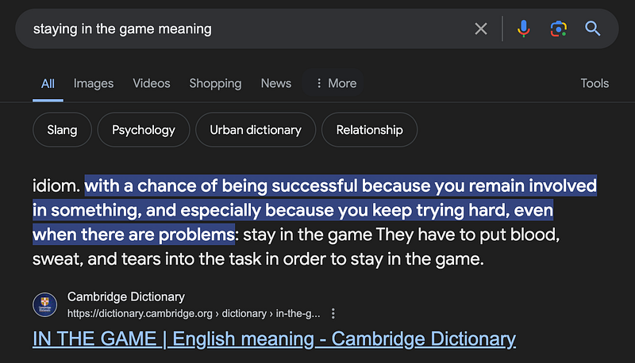

This is kind of a different article compared to the ones I usually write. I’ve been thinking of this for a long time, so thought what the heck I would write this.

Staying in the game is a very interesting concept, mostly for software engineers it’s a great lifestyle to follow. This is the google result I got :P

Now the meaning we have here is somewhat different from what I’m going to discuss, but not so different. For many new software engineers out there, job itself seems to be somewhat stressing. I’ve heard so many complains over the years, from people of various levels. Specifically I had a relative who quit Software Engineering because of stress.

I’ve heard this really interesting statement made by Amazon founder Jeff Bezos. I can’t remember the exact whole thing but the underline meaning was something like this.

> Stress primarily comes from not because of hard working, it mainly comes due to not taking actions.

Now this is really valuable piece of advice, specially for software engineers. This is where staying in the game makes sense a lot.

Let’s say you are stuck in a task, and can’t see any solution. What most of us do is leave it to the end. And once the deadline strikes we get all stressed out and blow our minds out. We all used to be this person and in some aspect of our work most of us still do.

Now the solution I propose is very simple. Literally stay in the game. If you find some task boring, try to research around the task, and maybe write a medium article (that’s what I do), then soon enough you will see your task getting more interesting than you initially thought. Then what about hard tasks where you get stuck. Try the same thing, go around the specific task or issue, and find interesting fixes and methods to approach it. Never leave it to the end. If you do, as Jeff Bezos mentioned you will definitely be stressed.

While scrolling through Youtube shorts, recently I heard this very interesting fact about Eminem. So basically what he does is anywhere he goes, he will find a pen and a paper and write rhymes. So when he need to freestyle, he has the upper hand. How? by staying in the game. When you put enough hours in something, it become a habit and in the long run you will appear as a natural. (I think this part may have been from atomic habits, I can’t remember but I have read quite a good amount of non fictional books to say these types of things to other people like a natural :P).

Similarly if you always try new technologies, research around stuff and if you stay in the game, for sure you won’t get stressed over work and sometimes by seeing at issues or tasks you will foresee solutions. This really comes in handy if your job is very critical and fast phase. Let’s say you see a production issue, and with years of staying in the game, most of the time you will recognise the issue just by seeing the error logs (this is really important for engineers who maintain software with a great fault tolerance). For fast phase scenarios, mmmm, I think it should be obvious by now, how would this affect.

In conclusion, staying in the game as a software engineer means continuously engaging with your work, seeking out new knowledge, and addressing challenges head-on rather than procrastinating. By adopting this mindset, you can reduce stress, enhance your problem-solving skills, and become more adept at handling fast-paced and critical situations. Remember, like Eminem with his rhymes, the more you immerse yourself in your field, the more naturally proficient you’ll become. So, keep learning, stay curious, and never stop playing the game. This approach will not only help you thrive in your career but also make your journey as a software engineer much more fulfilling and enjoyable.

Happy Coding :P
