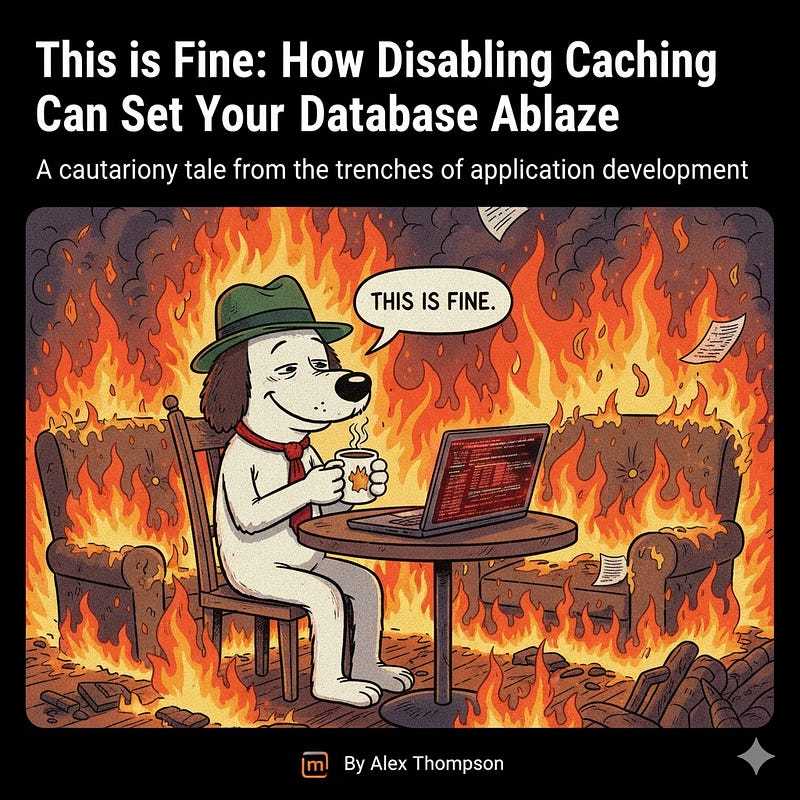

We’ve all been there. A bug report lands on your desk, urgent and perplexing. The pressure is on. You’re diving through code, tracing execution paths, and then… you find it. A line of code that, in a moment of brilliance (or perhaps, desperation), you decide to comment out. Or, even better, a configuration setting you flip. “This will fix it,” you think. “Just for now.”

My colleague recently had one of these moments. A particularly nasty bug was causing some unpredictable behavior in our application. After some investigation, he identified a potential culprit: the caching layer. “Aha!” he must have thought. “If we just disable caching, the data will always be fresh, and this bug will vanish!”

And vanish it did. The immediate problem was solved. High fives all around! But as the saying goes, “Out of the frying pan, into the fire.” Or, in our case, “Out of the bug, into a database inferno.”

Caching exists for a reason. In modern applications, databases are often the bottleneck. Every query, every read, every write takes time and consumes resources. Caching acts as a shield, absorbing the vast majority of read requests and serving them up from fast, in-memory stores. This significantly reduces the load on your database, allowing it to handle more complex operations and maintaining overall application performance.

When you disable caching, you effectively remove that shield. Every single request that previously would have been served from the cache now goes directly to the database.

Imagine a popular e-commerce site. A user lands on the homepage, browses categories, views product details. With caching, many of these actions would hit the cache. Without it, every click, every page load, translates into direct database queries. Multiply that by hundreds, thousands, or even millions of concurrent users, and you have a recipe for disaster.

## The Stages of Database Meltdown

- **Initial Silence (The Honeymoon Phase):** For a brief period, everything might seem fine. The bug is gone! Performance might even appear acceptable under light load. This is the calm before the storm.
- **The Whispers (Increased Latency):** As traffic increases, you start to notice things. Pages load a bit slower. API responses take a few extra milliseconds. Individual database queries might seem fine, but the cumulative effect is building.
- **The Roar (Resource Exhaustion):** Now, the database is really feeling the heat. CPU utilization spikes. I/O operations go through the roof. Connection pools are maxed out. You start seeing “database connection refused” errors.
- **The Inferno (Total Collapse):** At this point, the database can no longer cope. It becomes unresponsive, queries time out, and the entire application grinds to a halt. Users are met with error messages, and your incident response team is paging everyone in sight.

My colleague, bless his heart, believed that because the immediate bug was fixed, the database was “FINE.” He was sitting there, metaphorically sipping coffee, while the room around him was rapidly becoming engulfed in flames.

## What to Do When the Fire Starts

If you find yourself in a similar situation, here’s a quick checklist:

- **Re-enable Caching (Immediately, if possible):** This is the fastest way to alleviate pressure.
- **Monitor Database Metrics:** Keep a close eye on CPU, memory, I/O, active connections, and query execution times. Tools like Prometheus, Grafana, Datadog, or your cloud provider’s monitoring services are invaluable here.
- **Identify the Root Cause:** The original bug that led to disabling caching still needs to be properly fixed. Don’t let a temporary workaround become a permanent problem.
- **Optimize Queries:** While caching is vital, inefficient queries will still strain your database. Review and optimize frequently run queries.
- **Scale Up (Temporarily):** In an emergency, you might need to temporarily scale up your database instance to handle the increased load, buying yourself time to properly re-implement caching and fix the underlying issues.

## The Moral of the Story

Caching isn’t just a “nice-to-have”; it’s a critical component of scalable application architecture. Disabling it without understanding the profound impact on your database is akin to removing the foundation of a skyscraper because one window was stuck. The immediate problem might disappear, but you’re creating a much larger, potentially catastrophic, issue.

Next time you’re tempted to bypass a fundamental part of your system to squash a bug, remember the dog in the burning room. It might seem “fine” for a moment, but the fire is spreading, and your database is definitely not okay.
