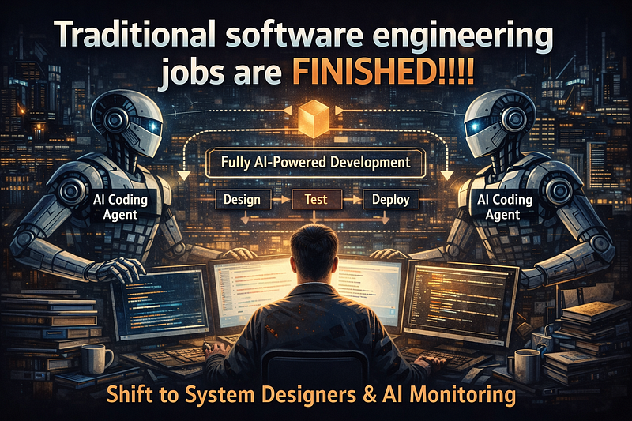

For the first time after long resisting letting AI agents do full changes to a codebase, this weekend I did a project using Claude Code and didn’t write a single line of code.



A project like this with unit tests, integration tests, proper CI/CD pipelines and everything would have taken me at least 3–4 days. I did it in under 12 hours.

If you want to ship something quickly without exhausting all your tokens, this guide might help.

This article is about what I did instead of writing code.

At least for now, even the best LLM models need a lot of guidance when it comes to producing a clean, production-grade product. This is where system design principles become your superpower.

Before starting the project, you should be clear about:

- High Level System Design (HLD)
- Low Level Design (LLD)

High Level Design covers what the application does: stakeholders, core entities, scalability, infrastructure, boundaries.

Low Level Design focuses on code-level structure: design patterns, module boundaries, OOP principles, error handling, testing strategy.

Let’s walk through a simple example.

You are asked to create an admin console application to handle a media pipeline orchestration.

## Step 1: High Level Design

## Functional Requirements

- CRUD for media metadata
- Trigger transcoding (using AWS MediaConvert)
- Update metadata with transcoded resource URLs

## Non-Functional Requirements

- Eventually consistent system
- Highly available
- Should handle ~1K RPS
- Idempotent operations for job triggering
- Observability (metrics + logs)

## Core Entities

- MediaItem
- TranscodeJob
- User

## API Design

```bash
POST   /media-items
GET    /media-items
GET    /media-items/{id}
PUT    /media-items/{id}
DELETE /media-items/{id}
```

```
POST   /transcode-jobs
GET    /transcode-jobs/{jobId}
```

Example:

POST /media-items
→ 201 { mediaItemId }

POST /transcode-jobs
→ 201 { transcodeJobId, status }

## Step 2: High Level Architecture

Instead of asking the AI to “build the project”, I first gave it an architecture blueprint.

## Architecture Components

- API Service (stateless, horizontally scalable)
- Relational Database (PostgreSQL)
- Message Queue (for async job processing)
- Worker Service (transcode orchestration)
- AWS MediaConvert integration
- Object storage (S3)
- CI/CD pipeline

## Flow

- User creates MediaItem → Stored in DB.
- User triggers TranscodeJob → API stores job in DB with status = PENDING.
- API publishes event to Queue.
- Worker consumes event.
- Worker calls AWS MediaConvert.
- MediaConvert sends callback / status polling.
- Worker updates TranscodeJob status and MediaItem URLs.

This separation alone prevents AI from creating a spaghetti monolith.

When you define clear service boundaries, AI follows them.

## Step 3: Database Design

Instead of saying “create models”, I gave schema-level instructions.

## MediaItem

- id (UUID)
- title
- description
- mediaType
- rawFileUrl
- transcodedUrl
- createdAt
- updatedAt

## TranscodeJob

- id (UUID)
- mediaItemId (FK)
- status (PENDING | PROCESSING | COMPLETED | FAILED)
- providerJobId
- createdAt
- updatedAt

## User

- id
- role (ADMIN)

When AI understands relationships, it generates much cleaner repositories and service layers.

## Step 4: Low Level Design

This is where most developers fail with AI.

They say: “build the backend in Node.js”.

Instead, I gave it:

## Tech Stack

- Node.js + TypeScript
- Express
- PostgreSQL
- Prisma ORM
- Jest (unit tests)
- Supertest (integration tests)
- Docker
- GitHub Actions CI

## Architectural Pattern

- Clean Architecture
- Controller → Service → Repository
- Dependency injection
- DTO validation layer
- Centralized error handling middleware
- Structured logging

When you define this clearly, AI doesn’t hallucinate random patterns.

It follows structure.

## Step 5: Test-First Prompting

This was a game changer. Instead of:

“Build media controller”

I did:

- “Write integration tests for media endpoints based on the API contract.”
- “Now implement controller logic to satisfy these tests.”
- “Now implement service layer.”
- “Now implement repository layer.”

By forcing AI to satisfy tests, it behaved like a disciplined junior engineer.

## Step 6: CI/CD & DevOps

I explicitly asked for:

- Dockerfile
- docker-compose for local dev
- Health check endpoint
- GitHub Actions pipeline:
- Install dependencies
- Run lint
- Run tests
- Build
- Fail on coverage < 80%

When you specify quality gates, AI doesn’t cut corners.

## Step 7: Handling Non-Functional Requirements

To meet 1K RPS:

- Stateless API pods
- Horizontal scaling
- DB connection pooling
- Async job processing
- Retry with exponential backoff
- Idempotency key for transcode trigger

I also asked AI to:

- Add request validation
- Add rate limiting middleware
- Add structured logging
- Add metrics endpoint

Without explicitly asking, it wouldn’t have added half of this.

## What I Actually Did

I did not code. But,

- Designed the system
- Wrote structured prompts
- Reviewed architecture
- Corrected edge cases
- Enforced constraints
- Iteratively refined outputs

I became the architect and reviewer. AI became the implementer.

## The Brutal Truth

Traditional “code monkey” software engineering is dying. But ….

System design skill is becoming 10x more valuable.

If you only know how to write CRUD code, yes, you should be worried. If you know how to:

- Design scalable systems
- Define clear contracts
- Think in failure scenarios
- Structure clean architectures
- Write precise technical specs

You’re not being replaced. You’re being upgraded.

## The New Role of a Software Engineer

You are:

- System designer
- AI conductor
- Quality gatekeeper
- Architecture decision maker

AI writes syntax. You own thinking.

## Practical Advice

If you want to survive (and thrive):

- Master High Level Design.
- Master Low Level Design.
- Learn distributed systems fundamentals.
- Learn how to write structured prompts.
- Think in constraints and contracts.
- Always enforce testing.

The engineers who adapt will ship 10x faster. The ones who don’t will feel like the world is collapsing.

## Final Thought

Jobs are not finished. Low-skill implementation-only roles are shrinking. High-leverage system thinkers are becoming unstoppable. The future isn’t AI replacing engineers. It’s engineers who use AI replacing engineers who don’t. And after this weekend, I’m convinced: The bottleneck is no longer writing code. It’s thinking clearly.

The moment AI can:

- Define product vision without being prompted
- Negotiate trade-offs between business, cost, and scalability
- Detect flawed requirements and push back
- Handle undefined edge cases without human framing
- Take accountability for failures

that’s the moment software engineers become optional.
