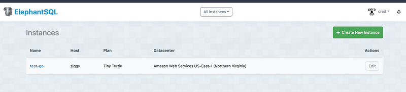

Hi Guys, This is the second part of the GO series. In the last tutorial we discuss how to start a basic web server using Go and Gin. Now in this tutorial we will be looking in to do CRUD operation for over application using Go, Gin and Postgres. For the last tutorial see the following link.

As the first step let’s create a postgres database. You can create a database in your local environment or else you can find a free solution like ElephantSQL.



Now let’s think of a way to connect our postgres website to our go application. I will be using Gorm which is one of the most famous ORM solutions for go. Let’s install the postgres driver.

```bash
go get -u gorm.io/gorm
go get -u gorm.io/driver/postgres
```

Now let’s create the database.go file

```
package main

import (
 "billacode/wasteGo/models"

 "gorm.io/driver/postgres"
 "gorm.io/gorm"
)

var DB *gorm.DB

func ConnectDatabase() {
 dsn := "host=<HOST> user=<USER> password=<PASSWORD> dbname=<DATABASE>"
 database, err := gorm.Open(postgres.Open(dsn), &gorm.Config{})

 if err != nil {
  panic("Failed to connect to database!")
 }

 err = database.AutoMigrate(&models.WasteItem{})
 if err != nil {
  return
 }

 DB = database
}
```

In this file we have write a method to connect to the postgres database and also using AutoMigrate method, we are populating the table as defined in the WasteItem model in postgres database. Now to define primary key I have done simple change in our WasteItem modal and taken out it to a package called models. (Create a folder named models and put this waste_item.go file inside)

```
package models

type WasteItem struct {
 ID       string `json:"id" gorm:"primary_key"`
 Name     string `json:"name"`
 Type     string `json:"type"`
 Quantity int    `json:"quantity"`
}
```

Ok now everything is ready, now let’s go anc change our main.go file where the Gin server is set.

We need to set a endpoint for creating a waste item.

```
func CreateWasteItem(c *gin.Context) {
 var input models.WasteItem
 if err := c.ShouldBindJSON(&input); err != nil {
  c.JSON(http.StatusBadRequest, gin.H{"error": err.Error()})
  return
 }

 customer := models.WasteItem{ID: input.ID, Name: input.Name, Type: input.Type}
 DB.Create(&customer)

 c.JSON(http.StatusOK, gin.H{"data": customer})
}

func main() {
 router := gin.Default()
 ConnectDatabase()

 router.POST("/wasteItem", CreateWasteItem)

 router.Run("localhost:8080")
}
```

Here we create a function called CreateWasteItem and its called when post request is coming. DB is the database client exported from database.go file.

Now to get all the waste items we added, we chnage our previous implmentation and the final code would look something like this.

```
package main

import (
 "billacode/wasteGo/models"
 "net/http"

 "github.com/gin-gonic/gin"
)

func GetWasteItems(c *gin.Context) {
 var wasteItems []models.WasteItem
 DB.Find(&wasteItems)

 c.JSON(http.StatusOK, gin.H{"data": wasteItems})
}

func CreateWasteItem(c *gin.Context) {
 var input models.WasteItem
 if err := c.ShouldBindJSON(&input); err != nil {
  c.JSON(http.StatusBadRequest, gin.H{"error": err.Error()})
  return
 }

 customer := models.WasteItem{ID: input.ID, Name: input.Name, Type: input.Type}
 DB.Create(&customer)

 c.JSON(http.StatusOK, gin.H{"data": customer})
}

func main() {
 router := gin.Default()
 ConnectDatabase()

 router.GET("/wasteItems", GetWasteItems)
 router.POST("/wasteItem", CreateWasteItem)

 router.Run("localhost:8080")
}
```

So everything seems pretty straight forward. In the next article we will be creating a simple flutter app to add waste items and view added waste items. Happy coding !!! :P

Additional thing, When you use this from browser or some other service, there can be scenarios when requests are blocked by CORS. So to configure these Go also have a cors library.

```
got get -u github.com/gin-contrib/cors
```

Now change the main.go file like this

```
package main

import (
 "billacode/wasteGo/configs"
 "billacode/wasteGo/controllers"

 "github.com/gin-contrib/cors"
 "github.com/gin-gonic/gin"
)

func main() {
 router := gin.Default()
 config := cors.DefaultConfig()
 config.AllowOrigins = []string{"*"} // Allow all origins
 config.AllowMethods = []string{"GET", "POST", "PUT", "DELETE", "OPTIONS"}
 config.AllowHeaders = []string{"Origin", "Content-Type"}

 // Use CORS middleware
 router.Use(cors.New(config))

 configs.ConnectDatabase()

 router.GET("/wasteItems", controllers.GetWasteItems)
 router.POST("/wasteItem", controllers.CreateWasteItem)

 router.Run("localhost:8080")
}
```

Thanks and Happy Coding !!!
