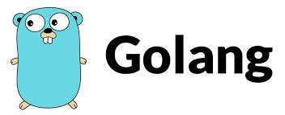

So in this tutorial we are going to look in to creating a backend Rest API using GO for our newest project. We will talk about scaling and all other improvements while building this app. But as the first step this will just be a Flutter App and a Go server.



As the first step, let’s learn how to create our GO server. Use this link to know how to install GO.

Now create your project directory and inside the folder run this command.

```
go mod init example/hello
```

This will create a file called go.mod in your directory.

```bash
module example/hello

go 1.21.5
```

So this contains module name and the go version we are using. So as this is our wasteGo app, I will change the module name to this.

```bash
module billacode/wasteGo

go 1.21.5
```

Now let’s create the simple helloWorld file. Create a file name hello.go

```
package main

import "fmt"

func main() {
 fmt.Println("Hello, World!")
}
```

Now let’s run and check this.

```
go run .
```

You will see Hello, World! printed in the console.

Now let’s move to the cool stuff. The first one is to see how we can create a web server. There are many libraries you can use to create a web server with GO but most used one Gyn. Let’s see how we can install and use Gin.

First let’s delete the previous hello.go file as we don’t need it anymore. Now create a file called main.go

```
package main

import (
 "net/http"

 "github.com/gin-gonic/gin"
)

type wasteItem struct {
 ID       string `json:"id"`
 Name     string `json:"name"`
 Type     string `json:"type"`
 Quantity int    `json:"quantity"`
}

var wasteItems = []wasteItem{
 {ID: "1", Name: "Soda Can", Type: "Metal", Quantity: 550},
 {ID: "2", Name: "News Papers", Type: "Paper", Quantity: 10},
}

func getWasteItems(c *gin.Context) {
 c.IndentedJSON(http.StatusOK, wasteItems)
}

func main() {
 router := gin.Default()
 router.GET("/wasteItems", getWasteItems)

 router.Run("localhost:8080")
}
```

So you see, here we create wasteItem entity type and then we define an example array. Now we define a function here to send that array when GET request is called. Same as the hello.go file here also what is being running is the code inside the main() function. Here we have imported router from Gin and it’s used to create the server as well as create the GET endpoint. Now before running this, run the following command to get dependencies we used in this code.

```
go get .
```

Now go and check the go.mod file

```
module billacode/wasteGo

go 1.21.5

require github.com/gin-gonic/gin v1.9.1

require (
 github.com/bytedance/sonic v1.9.1 // indirect
 github.com/chenzhuoyu/base64x v0.0.0-20221115062448-fe3a3abad311 // indirect
 github.com/gabriel-vasile/mimetype v1.4.2 // indirect
 github.com/gin-contrib/sse v0.1.0 // indirect
 github.com/go-playground/locales v0.14.1 // indirect
 github.com/go-playground/universal-translator v0.18.1 // indirect
 github.com/go-playground/validator/v10 v10.14.0 // indirect
 github.com/goccy/go-json v0.10.2 // indirect
 github.com/json-iterator/go v1.1.12 // indirect
 github.com/klauspost/cpuid/v2 v2.2.4 // indirect
 github.com/leodido/go-urn v1.2.4 // indirect
 github.com/mattn/go-isatty v0.0.19 // indirect
 github.com/modern-go/concurrent v0.0.0-20180306012644-bacd9c7ef1dd // indirect
 github.com/modern-go/reflect2 v1.0.2 // indirect
 github.com/pelletier/go-toml/v2 v2.0.8 // indirect
 github.com/twitchyliquid64/golang-asm v0.15.1 // indirect
 github.com/ugorji/go/codec v1.2.11 // indirect
 golang.org/x/arch v0.3.0 // indirect
 golang.org/x/crypto v0.9.0 // indirect
 golang.org/x/net v0.10.0 // indirect
 golang.org/x/sys v0.8.0 // indirect
 golang.org/x/text v0.9.0 // indirect
 google.golang.org/protobuf v1.30.0 // indirect
 gopkg.in/yaml.v3 v3.0.1 // indirect
)
```

Now let’s run the app again.

```
go run .
```

Now the endpoint should be accepting GET requests

[http://localhost:8080/wasteItems](http://localhost:8080/wasteItems)

This should return whatever is in our wasteItems array. So the implementation should be pretty straight forward and if you are a person who is familiar with nodeJS, this is like creating a nodeJS server using Express.

In the next tutorial we will be looking at how to connect this to a postgres database and do full CRUD operations. Happy Coding !!! :P
