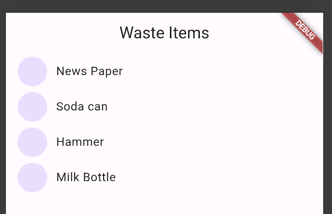
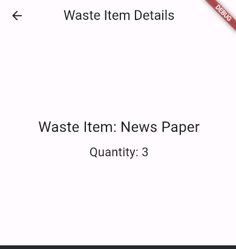

Hi Guys, As promised in this tutorial we will be creating out basic flutter app to list down all the waste items coming through the backend API we created in the previous article.

Now to learn how to use Flutter, I invite you guys to read the following article which I published 2 years back. It has everything you need to know when creating the first Flutter app.

If not just create a `skeleton` project using `vscode` for Flutter and delete all the unnecessary dart files. What you need is `main.dart` to initialise the app and from there you need to call the app. First of all, let’s create the `waste_item.dart` file. Create a folder named `waste_item_feature` inside `lib/src` folder and create a file named `waste_item.dart` inside.

```
class WasteItem {
  final String id;
  final String name;
  final String type;
  final int quantity;

  const WasteItem({
    required this.id,
    required this.name,
    required this.type,
    required this.quantity,
  });

  factory WasteItem.fromJson(Map<String, dynamic> json) {
    return WasteItem(
      id: json['id'],
      name: json['name'],
      type: json['type'],
      quantity: json['quantity'],
    );
  }

  static getWasteItems() {
    return [
      const WasteItem(id: '1', name: 'News Paper', type: 'paper', quantity: 3),
      const WasteItem(id: '2', name: 'Soda can', type: 'metal', quantity: 4),
      const WasteItem(id: '3', name: 'Hammer', type: 'metal', quantity: 5),
      const WasteItem(id: '4', name: 'Milk Bottle', type: 'glass', quantity: 6)
    ];
  }
}
```

The `fromJson` constructor inside the `WasteItem` class is designed to convert JSON data into a corresponding Dart object (`WasteItem`). It takes a `Map<String, dynamic>` as input, extracting specific keys ('id', 'name', 'type', 'quantity') from the map to initialize a new instance of `WasteItem`. This constructor is typically used when converting JSON data received from APIs or stored sources into usable Dart objects within Flutter or Dart applications, streamlining the process of handling and integrating external data formats into the app's internal data structures. getWasteItems is a temporary test method to set data for our app until api is connected.

Next file is the main.dart file

```
import 'package:flutter/material.dart';

import 'src/app.dart';

void main() async {
  runApp(const WasteGoApp());
}
```

This run the WasteGoApp which is in the app.dart file

```typescript
import 'package:flutter/material.dart';
import 'package:flutter_gen/gen_l10n/app_localizations.dart';
import 'package:flutter_localizations/flutter_localizations.dart';
import 'package:wastego/src/waste_item_feature/waste_item.dart';
import 'package:wastego/src/waste_item_feature/waste_item_list_view.dart';

class WasteGoApp extends StatelessWidget {
  const WasteGoApp({
    super.key,
  });

  @override
  Widget build(BuildContext context) {
    return MaterialApp(
      restorationScopeId: 'app',
      localizationsDelegates: const [
        AppLocalizations.delegate,
        GlobalMaterialLocalizations.delegate,
        GlobalWidgetsLocalizations.delegate,
        GlobalCupertinoLocalizations.delegate,
      ],
      supportedLocales: const [
        Locale('en', ''),
      ],
      onGenerateTitle: (BuildContext context) =>
          AppLocalizations.of(context)!.appTitle,
      theme: ThemeData(),
      darkTheme: ThemeData.light(),
      onGenerateRoute: (RouteSettings routeSettings) {
        return MaterialPageRoute<void>(
          settings: routeSettings,
          builder: (BuildContext context) {
            switch (routeSettings.name) {
              default:
                return WasteItemListView(
                  wasteItems: WasteItem.getWasteItems(),
                );
            }
          },
        );
      },
    );
  }
}
```

I have kept what came from skeleton project for Locales and Material theme. Now what is important to note is in MaterialApp `onGenerateRoute` method we handle default route to load `WasteItemListView` . Now let’s see how to code the list view. Create a file named `waste_item_list_view.dart` inside `waste_item_feature` folder.

```
import 'package:flutter/material.dart';
import 'package:wastego/src/waste_item_feature/waste_item_details_view.dart';
import 'waste_item.dart';

class WasteItemListView extends StatelessWidget {
    final List<WasteItem> wasteItems;

    const WasteItemListView({super.key, required this.wasteItems});

    @override
  Widget build(BuildContext context) {
    return Scaffold(
      appBar: AppBar(
        title: const Text('Waste Items'),
      ),
      body: ListView.builder(
        itemCount: wasteItems.length,
        itemBuilder: (BuildContext context, int index) {
          final item = wasteItems[index];

          return ListTile(
            title: Text(item.name),
            leading: const CircleAvatar(
              foregroundImage: AssetImage('assets/images/logos/app_logo.png'),
            ),
            onTap: () {
              Navigator.push(
                context,
                MaterialPageRoute(
                  builder: (context) => WasteItemDetailsView(item: item),
                ),
              );
            }
          );
        },
      ),
    );
  }
}
```

This view simply load wasteItems send from the App. So we display them using `ListTile` of Flutter and it has `onTap` method which is triggered when user tap on a tile. Now using `MaterialPageRoute` we can send an item to the next screen which is `WasteItemDetailsView` . Now let’s create another file called waste_item_details_view.dart in the same directory.

```
import 'package:flutter/material.dart';
import 'package:wastego/src/waste_item_feature/waste_item.dart';

class WasteItemDetailsView extends StatelessWidget {
  const WasteItemDetailsView({super.key, required this.item});

  final WasteItem item;

  @override
  Widget build(BuildContext context) {
    return Scaffold(
      appBar: AppBar(
        title: const Text('Waste Item Details'),
      ),
      body: Center(
        child: Column(
          mainAxisAlignment: MainAxisAlignment.center,
          children: [
            Text(
              'Waste Item: ${item.name}',
              style: const TextStyle(fontSize: 24),
            ),
            const SizedBox(height: 10),
            Text(
              'Quantity: ${item.quantity}',
              style: const TextStyle(fontSize: 20),
            ),
          ],
        ),
      ),
    );
  }
}
```

This would display name and quantity of a wasteItem. Finally you would get something like this when this is run.



Pretty cool right. If you click on of these tiles, you would see something like this.



But this is not the completed code. We still need to connect this to our Go server. For this we need `http` package of flutter.

```
flutter pub add http
```

Now the next step is to create the http_service.dart file

```
import 'dart:convert';
import 'package:http/http.dart';
import 'package:wastego/src/waste_item_feature/waste_item.dart';

class HttpService {
  final String wasteItemsURL = "http://localhost:8080/wasteItems";

  Future<List<WasteItem>> getWasteItems() async {
    Response res = await get(Uri.parse(wasteItemsURL));

    if (res.statusCode == 200) {
      final obj = jsonDecode(res.body);
      final receivedWasteItemList = obj['data'];
      List<WasteItem> wasteItems =  List.empty(growable: true);

      for (int i = 0; i < receivedWasteItemList.length; i++) {
        WasteItem wasteItem = WasteItem.fromJson(receivedWasteItemList[i]);
        wasteItems.add(wasteItem);
      }

      return wasteItems;
    } else {
      throw "Unable to retrieve waste items.";
    }
  }
}
```

We take the response body and do a JSON decode first and then take the data object inside it. Then we use our JSON decode method we created inside waste_item.dart file to convert it to a prooer WasteItem and then from we return a list.

Now let’s use the getWasteItems from here in our waste_item_list_view.dart file.

```
import 'package:flutter/material.dart';
import 'package:wastego/src/services/http_service.dart';
import 'package:wastego/src/waste_item_feature/waste_item_details_view.dart';
import 'waste_item.dart';

class WasteItemListView extends StatelessWidget {
  final HttpService httpService = HttpService();
  WasteItemListView({super.key});

  @override
  Widget build(BuildContext context) {
    return Scaffold(
        appBar: AppBar(
          title: const Text('Waste Items'),
        ),
        body: FutureBuilder(
          future: httpService.getWasteItems(),
          builder:
              (BuildContext context, AsyncSnapshot<List<WasteItem>> snapshot) {
            if (snapshot.hasData) {
              List<WasteItem> wasteItems = snapshot.data ?? [];
              return ListView.builder(
                itemCount: wasteItems.length,
                itemBuilder: (BuildContext context, int index) {
                  final item = wasteItems[index];

                  return ListTile(
                      title: Text(item.name),
                      leading: const CircleAvatar(
                        foregroundImage:
                            AssetImage('assets/images/logos/app_logo.png'),
                      ),
                      onTap: () {
                        Navigator.push(
                          context,
                          MaterialPageRoute(
                            builder: (context) =>
                                WasteItemDetailsView(item: item),
                          ),
                        );
                      });
                },
              );
            } else {
              return const Center(child: CircularProgressIndicator());
            }
          },
        ));
  }
}
```

So we have added a few changes here. The first one is we used a future builder. In Dart Future means async data types. So what future builder does is it gives a context for us to wait till data is loaded. The rest of the code is self-explanatory. So if you have any questions about this please post them as comments I will be happy to answer them.

Now the next step is to create a waste item using the app. We have created our API in our last tutorial for that so we will be tackling that from Flutter in the next tutorial. Till then Happy Coding !!! :P
