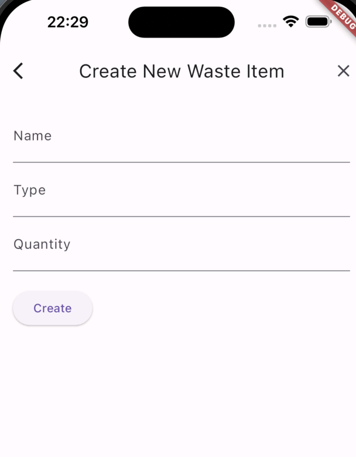

Hi Guys, So we created our Flutter app in the last tutorial and created views for listing and showing details.

In this tutorial, I will be creating a separate view to create a waste item. So the backend endpoint related to this was created using GO and Gin.

Now as the first step let’s create our waste_item_create_view.dart file. So the first thing is to create a class to store the initial values of Form.

```
class WasteItemFormData {
  String name = '';
  int quantity = 0;
  String type = '';
}
```

Then we create a stateless widget with Flutter Form component in it. Then we use `TextFormField` as input components.

```
TextFormField(
  decoration: const InputDecoration(labelText: 'Name'),
  onChanged: (value) {
    formData.name = value;
  },
),
```



Now we have handled the input change where we add the input value to WasteItemFormData object we initialise. Then at the click of the create button, we will send these data in to a `createWasteItem` function in `httpServervice` we created in our last tutorial. When the return boolean from `createWasteItem` method is true, we navigate to list view. Otherwise it would stay with an error message.

```
import 'package:flutter/material.dart';
import 'package:wastego/src/services/http_service.dart';
import 'package:wastego/src/waste_item_feature/waste_item_list_view.dart';

class WasteItemFormData {
  String name = '';
  int quantity = 0;
  String type = '';
}

class WasteItemCreateView extends StatelessWidget {
  final HttpService httpService = HttpService();
  final WasteItemFormData formData = WasteItemFormData();

  WasteItemCreateView({Key? key}) : super(key: key);

  @override
  Widget build(BuildContext context) {
    return Scaffold(
      appBar: AppBar(
        title: const Text('Create New Waste Item'),
      ),
      body: Padding(
        padding: const EdgeInsets.all(16.0),
        child: Form(
          child: Column(
            crossAxisAlignment: CrossAxisAlignment.start,
            children: [
              TextFormField(
                decoration: const InputDecoration(labelText: 'Name'),
                onChanged: (value) {
                  formData.name = value;
                },
              ),
              TextFormField(
                decoration: const InputDecoration(labelText: 'Type'),
                onChanged: (value) {
                  formData.type = value;
                },
              ),
              TextFormField(
                decoration: const InputDecoration(labelText: 'Quantity'),
                keyboardType: TextInputType.number,
                onChanged: (value) {
                  formData.quantity = int.tryParse(value) ?? 0;
                },
              ),
              const SizedBox(height: 20),
              ElevatedButton(
                onPressed: () async {
                  bool isCreated = await httpService.createWasteItem(
                      formData.name, formData.type, formData.quantity);
                  // ignore: duplicate_ignore
                  if (isCreated) {
                    // ignore: use_build_context_synchronously
                    Navigator.pushReplacement(
                      context,
                      MaterialPageRoute(
                        builder: (context) => WasteItemListView(),
                      ),
                    );
                  } else {
                    // ignore: use_build_context_synchronously
                    ScaffoldMessenger.of(context).showSnackBar(
                      const SnackBar(
                        content: Text('Failed to create waste item.'),
                      ),
                    );
                  }
                },
                child: const Text('Create'),
              ),
            ],
          ),
        ),
      ),
    );
  }
}
```

Now let’s implement the `createWasteItem` method in `http_service.dart` file.

```
Future<bool> createWasteItem(String name, String type, int quantity) async {
    Response res = await post(
      Uri.parse('http://localhost:8080/wasteItem'),
      headers: <String, String>{
        'Content-Type': 'application/json; charset=UTF-8',
      },
      body: jsonEncode({
        'Name': name,
        'Type': type,
        'Quantity': quantity,
      }),
    );

    if (res.statusCode == 200) {
      return true;
    } else {
      return false;
    }
  }
```

So this is pretty much it. If you want to check the code I will post my GitHub link here.

So Happy Coding Guys !!! Let me know if you have any questions.
