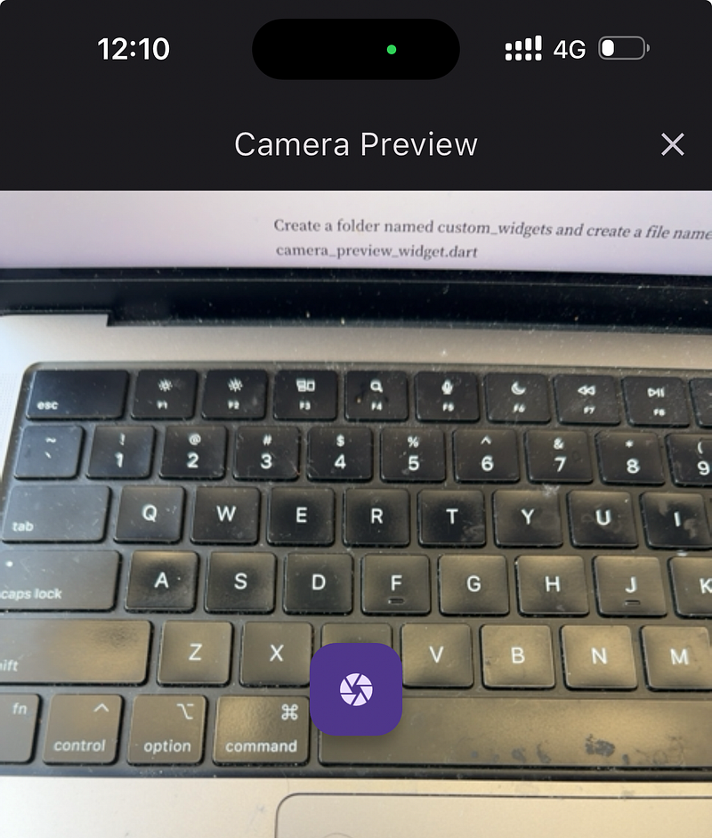
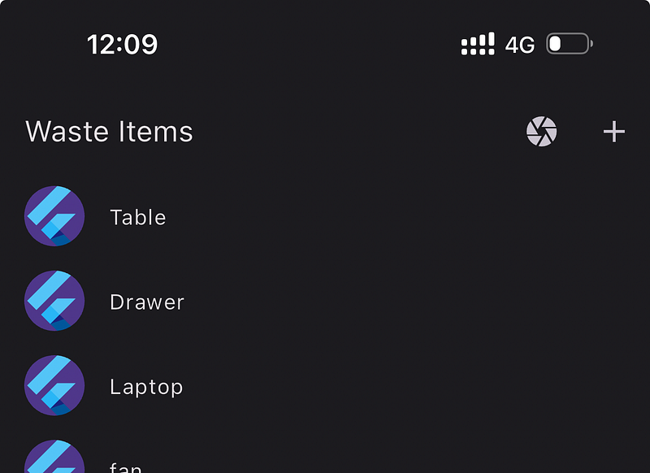

In the last tutorial we look in to how we can create a input form and use that data to create a record in our postgres database using our Go and Gin backend.

Now in this tutorial we will be looking at how to use the flutter camera module to take a photo and upload it to AWS S3 via our Go and Gin backend. As the first step let’s create the camera preview screen and connect it to our flutter app.



Create a folder named custom_widgets and create a file named camera_preview_widget.dart

```
import 'dart:io';

import 'package:flutter/material.dart';
import 'package:camera/camera.dart';
import 'package:wastego/src/waste_item_feature/waste_item_list_view.dart';

class CameraPreviewWidget extends StatefulWidget {
  final CameraDescription camera;
  final Function(File image) onImageCaptured;

  const CameraPreviewWidget({
    Key? key,
    required this.camera,
    required this.onImageCaptured,
  }) : super(key: key);

  @override
  CameraPreviewWidgetState createState() => CameraPreviewWidgetState();
}

class CameraPreviewWidgetState extends State<CameraPreviewWidget> {
  late CameraController _controller;
  late Future<void> _initializeControllerFuture;
  bool _isProcessing =
      false; // Added state to track if image processing is ongoing
  File? _capturedImage; // File to hold the captured image

  @override
  void initState() {
    super.initState();
    _controller = CameraController(
      widget.camera,
      ResolutionPreset.medium,
    );
    _initializeControllerFuture = _controller.initialize();
  }

  @override
  void dispose() {
    _controller.dispose();
    super.dispose();
  }

  @override
  Widget build(BuildContext context) {
    return Scaffold(
      appBar: AppBar(
        title: const Text('Camera Preview'),
        actions: [
          IconButton(
            icon: const Icon(Icons.close),
            onPressed: _handleCloseButtonPressed,
          ),
        ],
      ),
      body: _capturedImage == null
          ? Stack(
              children: [
                FutureBuilder<void>(
                  future: _initializeControllerFuture,
                  builder: (context, snapshot) {
                    if (snapshot.connectionState == ConnectionState.done) {
                      return CameraPreview(_controller);
                    } else {
                      return const Center(child: CircularProgressIndicator());
                    }
                  },
                ),
                if (_isProcessing) // Show loader when processing image
                  const Center(
                    child: CircularProgressIndicator(),
                  ),
              ],
            )
          : Image.file(_capturedImage!),
      floatingActionButton: Container(
        alignment: Alignment.center,
        child: FloatingActionButton(
          onPressed: _capturedImage == null
              ? (_isProcessing ? null : _handleCaptureButtonPressed)
              : _handleResetButtonPressed,
          child: _capturedImage == null
              ? const Icon(Icons.camera)
              : const Icon(Icons.refresh),
        ),
      ),
      floatingActionButtonLocation: FloatingActionButtonLocation.centerFloat,
    );
  }

  void _handleCaptureButtonPressed() async {
    setState(() {
      _isProcessing = true; // Start showing loader
    });
    try {
      await _initializeControllerFuture;
      final image = await _controller.takePicture();
      widget.onImageCaptured(File(image.path));
      setState(() {
        _capturedImage = File(image.path); // Set the captured image
      });
    } catch (e) {
      print('Error taking picture: $e');
    } finally {
      setState(() {
        _isProcessing = false; // Stop showing loader
      });
    }
  }

  void _handleResetButtonPressed() {
    setState(() {
      _capturedImage = null; // Clear the captured image
    });
  }

  void _handleCloseButtonPressed() {
    Navigator.pushReplacement(
      context,
      MaterialPageRoute(
        builder: (context) => WasteItemListView(),
      ),
    );
  }
}
```

This module allows users to capture images using the device’s camera and display them in a preview or after capturing.

- This is a stateful widget that takes a `CameraDescription` object and a callback function `onImageCaptured` as required parameters.
- The `camera` parameter represents the specific camera to use, and `onImageCaptured` is a callback function that returns the captured image as a `File`.
- State variables include `_isProcessing` to track image processing status and `_capturedImage` to hold the captured image file.

Now from the WasteItemListView component, we have to handle how this preview should appear.



Let’s go and edit it.

```
import 'dart:io';

import 'package:flutter/material.dart';
import 'package:wastego/src/services/http_service.dart';
import 'package:wastego/src/custom_widgets/camera_preview_widget.dart';
import 'package:wastego/src/waste_item_feature/waste_item_create_view.dart';
import 'package:wastego/src/waste_item_feature/waste_item_details_view.dart';
import 'waste_item.dart';
import 'package:camera/camera.dart';

class WasteItemListView extends StatelessWidget {
  final HttpService httpService = HttpService();
  WasteItemListView({super.key});

  void _openCamera(BuildContext context) async {
    final cameras = await availableCameras();
    if (cameras.isEmpty) {
      // Handle no available cameras
      return;
    }

    final camera = cameras.first;
    // ignore: use_build_context_synchronously
    Navigator.pushReplacement(
      context,
      MaterialPageRoute(
        builder: (context) => CameraPreviewWidget(
          camera: camera,
          onImageCaptured: (File image) async {
            // Handle the captured image here, for example, upload it
            bool isSuccess = await httpService.uploadImage(image);
            if (isSuccess) {
              // ignore: use_build_context_synchronously
              ScaffoldMessenger.of(context).showSnackBar(
                const SnackBar(content: Text('Image uploaded successfully')),
              );
            } else {
              // ignore: use_build_context_synchronously
              ScaffoldMessenger.of(context).showSnackBar(
                const SnackBar(content: Text('Failed to upload image')),
              );
            }
          },
        ),
      ),
    );
  }

  @override
  Widget build(BuildContext context) {
    return Scaffold(
        appBar: AppBar(
          title: const Text('Waste Items'),
          actions: [
            IconButton(
              icon: const Icon(Icons.camera),
              onPressed: () async {
                _openCamera(context);
              },
            ),
            IconButton(
              icon: const Icon(Icons.add),
              onPressed: () async {
                Navigator.pushReplacement(
                  context,
                  MaterialPageRoute(
                    builder: (context) => const WasteItemCreateView(labelName: '',),
                  ),
                );
              },
            ),
          ],
        ),
        body: RefreshIndicator(
          onRefresh: () async {
            await httpService.getWasteItems();
          },
          child: FutureBuilder(
            future: httpService.getWasteItems(),
            builder: (BuildContext context,
                AsyncSnapshot<List<WasteItem>> snapshot) {
              if (snapshot.hasData) {
                List<WasteItem> wasteItems = snapshot.data ?? [];
                return ListView.builder(
                  itemCount: wasteItems.length,
                  itemBuilder: (BuildContext context, int index) {
                    final item = wasteItems[index];

                    return ListTile(
                        title: Text(item.name),
                        leading: const CircleAvatar(
                          foregroundImage:
                              AssetImage('assets/images/flutter_logo.png'),
                        ),
                        onTap: () {
                          Navigator.pushReplacement(
                            context,
                            MaterialPageRoute(
                              builder: (context) =>
                                  WasteItemDetailsView(item: item),
                            ),
                          );
                        });
                  },
                );
              } else {
                return const Center(child: CircularProgressIndicator());
              }
            },
          ),
        ));
  }
}
```

Here we have created a private method called `_openCamera` and we trigger this when user press the camera button in the app bar. This function checks for available cameras on the device and opens the camera for capturing images in a Flutter application. It selects the first available camera and navigates to the`CameraPreviewWidget`, passing the camera information and an `onImageCaptured` callback function. This callback handles the captured image uploading. Based on the upload success, it shows a SnackBar message indicating whether the image upload was successful or not.

Now next thing is to implement imageUpload function in http_service.dart file.

```
Future<bool> uploadImage(File image) async {
    try {
      var request = MultipartRequest('POST', Uri.parse('${backendHost}wasteItem/uploadImage'));
      request.files.add(MultipartFile(
        'file',
        image.readAsBytes().asStream(),
        image.lengthSync(),
        filename: image.path.split('/').last,
      ));
      var response = await request.send();
      
      if (response.statusCode == 200) {
        return true;
      } else {
        return false;
      }
    } catch (e) {
      print('Error uploading image: $e');
      return false;
    }
  }
```

Here we upload the image as a Multipart request with the image file and if the status code is 200 we will return true.

## Go and Gin Backend API implementation for Image upload

Now let’s look at the backend implementation for image upload to AWS S3. In our main.go file in the backend project we will have to add a post request resolver to handle this.

Before diving in to the code, you should understand we are going to use AWS S3 and we need access to the account where our s3 bucket is located. First go there and create a IAM user with attached policy for s3 admin access (you can configure this as you want I did this for the simplicity) and then create a s3 bucket called wastego and please remember to enable **Access control list (ACL) **and also add the CORS for S3 bucket.

```json
[
    {
        "AllowedHeaders": [
            "*"
        ],
        "AllowedMethods": [
            "PUT",
            "POST",
            "DELETE",
            "GET"
        ],
        "AllowedOrigins": [
            "*"
        ],
        "ExposeHeaders": [
            "x-amz-server-side-encryption",
            "x-amz-request-id",
            "x-amz-id-2"
        ],
        "MaxAgeSeconds": 3000
    }
]
```

After that let’s change our main.go file to this.

```
package main

import (
 "billacode/wasteGo/configs"
 "billacode/wasteGo/controllers"
 "bytes"
 "encoding/json"
 "fmt"
 "io"
 "io/ioutil"
 "mime/multipart"
 "net/http"
 "os"

 "github.com/aws/aws-sdk-go/aws"
 "github.com/aws/aws-sdk-go/aws/session"
 "github.com/aws/aws-sdk-go/service/s3"
 "github.com/gin-contrib/cors"
 "github.com/gin-gonic/gin"
)

func main() {
 router := gin.Default()
 config := cors.DefaultConfig()
 config.AllowOrigins = []string{"*"} // Allow all origins
 config.AllowMethods = []string{"GET", "POST", "PUT", "DELETE", "OPTIONS"}
 config.AllowHeaders = []string{"Origin", "Content-Type"}

 // Use CORS middleware
 router.Use(cors.New(config))

 configs.ConnectDatabase()

 router.GET("/wasteItems", controllers.GetWasteItems)
 router.POST("/wasteItem", controllers.CreateWasteItem)
 router.DELETE("/wasteItem/:id", controllers.DeleteWasteItem)
 router.POST("/wasteItem/uploadImage", uploadImageS3)

 router.Run(":80")
}

func uploadImageS3(c *gin.Context) {
 file, header, err := c.Request.FormFile("file")
 if err != nil {
  c.JSON(http.StatusBadRequest, gin.H{"error": "Bad request"})
  fmt.Println("Error retrieving file:", err)
  return
 }
 defer file.Close()

 awsRegion := "us-east-1"

 sess := session.Must(session.NewSession(&aws.Config{
  Region: aws.String(awsRegion),
 }))

 svc := s3.New(sess)

 bucketName := "wastego"
 objectKey := header.Filename

 _, err = svc.PutObject(&s3.PutObjectInput{
  Bucket: aws.String(bucketName),
  Key:    aws.String(objectKey),
  Body:   file,
  ACL:    aws.String("public-read"), // Set ACL to allow public read access
 })
 if err != nil {
  c.JSON(http.StatusInternalServerError, gin.H{"error": "Error uploading file"})
  fmt.Println("Error uploading file to S3:", err)
  return
 }

 publicURL := fmt.Sprintf("https://%s.s3.amazonaws.com/%s", bucketName, objectKey)

 responseData, err := DetectS3Label(publicURL)
 if err != nil {
  c.JSON(http.StatusInternalServerError, gin.H{"error": "Failed to detect labels"})
  fmt.Println("Error detecting labels:", err)
  return
 }

 c.JSON(http.StatusOK, gin.H{"message": "File uploaded successfully"})
}
```

Here in this code we use AWS-SDK for Go and command PutObject to add the image file we receiving to the bucket.

Now everything is configured and your flutter app should successfully upload images to S3 bucket from camera.

If you have any question please post here and In the next tutorial we will be looking at how to use this image we stored in S3 bucket to detect the type of the object in the image using Eden AI.

Happy Coding !!! :P
