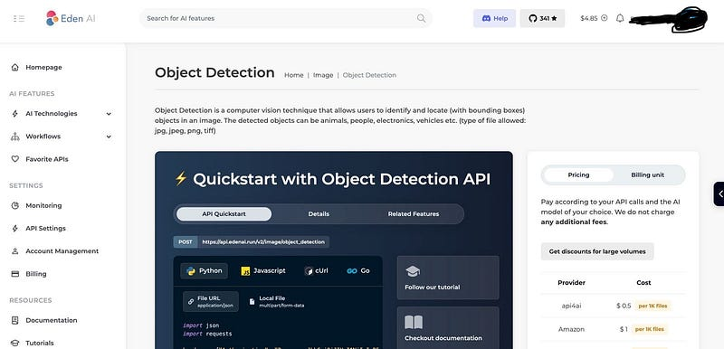

Hi Guys, In the last article I showed you guys how to create a camera preview widget in the flutter app and upload a image captured from the camera to S3 via our Go and Gin backend.

Now in this article, I will show you how to use an external API to detect the object we captured in the uploaded image.

As the first step let’s create a new function in our go code to detect the object in the image. Before that we have to create an account in Eden AI and check the API documentation. The reason to use EdenAI is it gives a free account (Dont even need to add credit card details with 5$ credits for developers) and also thorugh that we can use Google Vision, Amazon Rekongnition, Calrifai etc.. to process our image. I will be using Clarifai as it has a greater accuracy compared to the other providers.



Let’s edit the main.go file.

```
func DetectS3Label(imagePath string) (any, error) {
 url := "https://api.edenai.run/v2/image/object_detection"
 payload := map[string]interface{}{
  "providers":          "clarifai",
  "file_url":           imagePath,
  "fallback_providers": "",
 }
 payloadBytes, err := json.Marshal(payload)
 if err != nil {
  fmt.Println("Error encoding payload:", err)
 }

 req, err := http.NewRequest("POST", url, bytes.NewBuffer(payloadBytes))
 if err != nil {
  fmt.Println("Error creating request:", err)
 }
 req.Header.Set("Authorization", "Bearer <API KEY>")
 req.Header.Set("Content-Type", "application/json")

 client := &http.Client{}
 resp, err := client.Do(req)
 if err != nil {
  fmt.Println("Error sending request:", err)
 }
 defer resp.Body.Close()

 body, err := ioutil.ReadAll(resp.Body)
 if err != nil {
  fmt.Println("Error reading response body:", err)
 }

 return string(body), nil
}
```

In this function we set the providers as clarifai, if you want more you can add them as comma separated values. File URL is the public AWS S3 URL. No with these data we make a HTTP POST request to Eden AI API and get the detected values. Now the response will be something like this.

```json
{
  "clarifai": {
    "status": "success",
    "items": [
      {
        "label": "Poster",
        "confidence": 0.7009423,
        "x_min": null,
        "x_max": 0.99325603,
        "y_min": 0.011215723,
        "y_max": 0.98860765
      },
      {
        "label": "Human hand",
        "confidence": 0.5915319,
        "x_min": 0.18198867,
        "x_max": 0.37561744,
        "y_min": 0.38429785,
        "y_max": 0.7117659
      }
    ],
    "cost": 0.002
  },
  "eden-ai": {
    "status": "success",
    "items": [
      {
        "label": "Poster",
        "confidence": 0.7009423,
        "x_min": null,
        "x_max": 0.99325603,
        "y_min": 0.011215723,
        "y_max": 0.98860765
      },
      {
        "label": "Human hand",
        "confidence": 0.5915319,
        "x_min": 0.18198867,
        "x_max": 0.37561744,
        "y_min": 0.38429785,
        "y_max": 0.7117659
      }
    ]
  }
}
```

So this is about it and please post any question you have in the comments and Happy Coding :P
