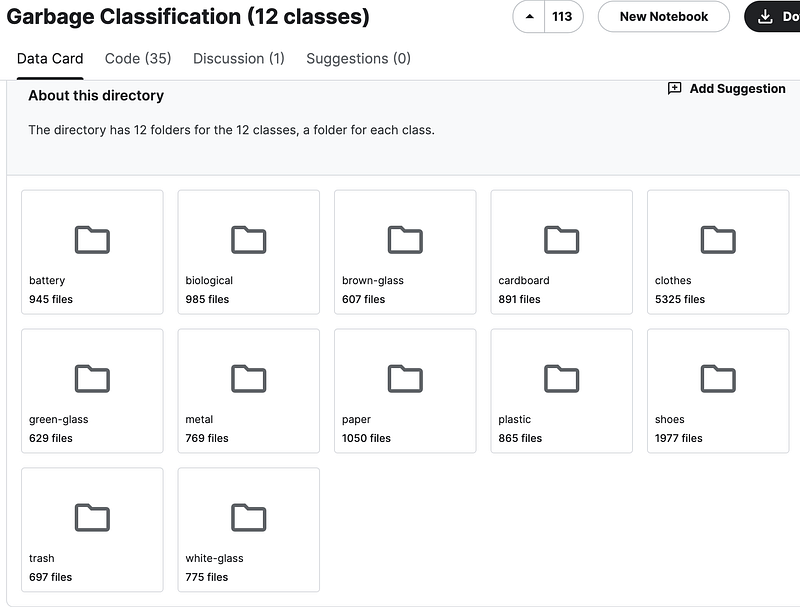
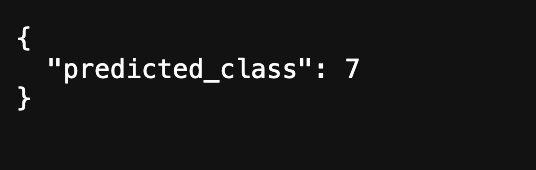

Hi Guys, So in the previous tutorial we connected our Golang backend to a third party API to get image detection results.

Btw if you are interested in the whole series we have been doing using Flutter and Go, please check this link.

In this tutorial we will be discussing how to do this using our own **machine learning model**. The main reason to do this is, in our actual requirement we don’t need to actually identify the object in the image. Our real requirement is to classify the image in to a class of waste items.

Now with machine learning, there’s always the need of data. If you go to Kaggle there are many free data sets available. There I found this interesting data set and you can access it from the following link.

In this dataset we have images for 12 different classes of waste items.



Now the plan is to use this data to train a solid deep learning model and then finally use it to predict the images we upload to AWS S3.

## **How Image classification works with Deep learning neural network models**

I’m not going to go deep in to the details but still I will simply teach you what is happening behind the scene. Now before talking about the image classification, you should understand how these deep learning neural network works. Actually it’s not that hard to understand.

**_Simply we give some input to the network and inside the network through various layers (Layers consist of interconnected neurons) it will train the model and finally using an output layer predicted output will be given._**

Remember this is the basic idea. There are lot of things happening behind the scene. Now to give a bit more context on what we are going to do I will divide my previous statement in to 5 parts.

- Input Data: **Images**
- Layers: **Convolutional layers for images and dense (fully connected) layers for general feature extraction.**
- Training: Adjusts its internal parameters (**weights and biases**) based on the input data and the expected output (**labels or targets**). This adjustment is done through **Adam optimization algorithm**, which is very popular in computer vision and NLP.
- Output Model: Once the model is trained on a sufficient amount of data, it produces an optimized set of parameters that can be used for making predictions. This optimized model is what you refer to as the “output model.”
- Predictions: With the trained model, you can feed new, unseen data into the model to obtain predictions or classifications. The model uses the learned patterns from the training data to make predictions on new, similar data.

Not that hard to digest right?. If you have any question please post here as a comment.

## **Implementation**

Basically this can be implemented by creating a simple model with Convulutional layer and few dense layers. But in my implementation, I will be using a prebuilt model as the base model for our neural network. If you go to the following link, you can see there are lot of such models.

In our implementation, I would be using **EfficientNetV2B1** model from **Keras**. Now don’t get me wrong I tried out lot of base models there and still found out this one is the best one for my user case (That’s machine learning for ya — Trial & Error). You can refer to each of these models and check pros and cons, so I’m not gonna bore you all with all that information.

I strongly recommend you guys to use a platform like **Google Colab or Kaggle **to do these type of work as training a model is very CPU intensive. But still it’s possible to do this in local env too. First thing is to get our dataset ready. So I downloaded the garbage_classification folder with images and kept it in the same directory where my train.py file is. Here we load the dataset folder and find the labels and data frames.

```python
import pandas as pd
import os
import glob
import numpy as np

image_data = 'garbage_classification'
pd.DataFrame(os.listdir(image_data),columns=['Files_Name'])

files = [i for i in glob.glob(image_data + "//*//*")]
np.random.shuffle(files)
labels = [os.path.dirname(i).split("/")[-1] for i in files]
data = zip(files, labels)
dataframe = pd.DataFrame(data, columns = ["Image", "Label"])
print(dataframe)
```

Next thing is to create the training and validating data sets. Now **tensorflow** **keras** has functions to get image datasets from a directory which make our work so easy. After splitting data for training and validation, I have print out the class names we have.

```python
import tensorflow as tf

train_data_dir =image_data
batch_size = 128
target_size = (224,224)
validation_split = 0.2

train= tf.keras.preprocessing.image_dataset_from_directory(
    train_data_dir,
    validation_split=validation_split,
    subset="training",
    seed=50,
    image_size=target_size,
    batch_size=batch_size,
)
validation= tf.keras.preprocessing.image_dataset_from_directory(
    train_data_dir,
    validation_split=validation_split,
    subset="validation",
    seed=100,
    image_size=target_size,
    batch_size=batch_size,
)

class_names = train.class_names
print(class_names)
```

Now it’s time to create our model. For this I’m going to create a function in here called **build_model**

```python
import keras
from keras.applications.efficientnet_v2 import EfficientNetV2B1
from keras import layers

def build_model(num_classes):
    inputs = layers.Input(shape=(224, 224, 3))
    model = EfficientNetV2B1(include_top=False, input_tensor=inputs, weights="imagenet")

    # Freeze the pretrained weights
    model.trainable = False

    # Rebuild top
    x = layers.GlobalAveragePooling2D(name="avg_pool")(model.output)
    x = layers.BatchNormalization()(x)

    top_dropout_rate = 0.2
    x = layers.Dropout(top_dropout_rate, name="top_dropout")(x)
    outputs = layers.Dense(num_classes, activation="softmax", name="pred")(x)

    # Compile
    model = keras.Model(inputs, outputs, name="EfficientNet")
    optimizer = keras.optimizers.Adam(learning_rate=1e-2)
    model.compile(
        optimizer=optimizer, loss="sparse_categorical_crossentropy", metrics=["accuracy"]
    )

    return model
```

Here we create an **input layer** with a shape of **(224, 224, 3)**, suitable for images. Then instantiate an **EfficientNetV2B1** model with the specified input shape, excluding the top classification layer (`include_top=False`) and initializing its weights with pre-trained **ImageNet weights** (`weights="imagenet"`). After that we freeze the weights of the pre-trained model to prevent them from being updated during training (`model.trainable = False`). Then we rebuild the top layers of the model for fine-tuning:

- Apply global average pooling to reduce the spatial dimensions of the output. (Flattening also a solution)
- Add batch normalization to normalize the activations.
- Apply dropout with a rate of 0.2 to reduce overfitting.
- Connect a dense layer with softmax activation for classification into `num_classes` categories.

After building the model we compile the model using the **Adam optimizer** with a **learning rate of 0.01**, using **sparse categorical cross-entropy loss** for multi-class classification and tracking accuracy as the evaluation metric.

```
model = build_model(12)
model.summary()

epochs = 10
hist = model.fit(train, epochs=epochs, validation_data=validation)

model.save('model.keras')
```

Here we build the model using our previous function and then view the summary of the model. Next thing is to train the model with our data set. For that we use **fit** method. At last we save our model to **keras** file, which we can use for **predicting** anywhere after loading this.

Now as the final step of our work, let’s create a simple **flask server **to do the prediction. Create a file named server.py

```python
import tensorflow as tf
import numpy as np
import requests
from flask import Flask, request, jsonify
from io import BytesIO

app = Flask(__name__)

# Load the saved model
loaded_model = tf.keras.models.load_model('model.keras')

def preprocess_image(url):
    response = requests.get(url)
    image = tf.keras.utils.load_img(BytesIO(response.content), target_size=(224, 224))
    input_arr = tf.keras.utils.img_to_array(image)
    input_arr = np.expand_dims(input_arr, axis=0)  # Convert single image to a batch.
    return input_arr

@app.route('/predict', methods=['GET'])
def predict():
    image_url = request.args.get('image_url')

    if not image_url:
        return jsonify({'error': 'Image URL not provided'}), 400

    try:
        input_arr = preprocess_image(image_url)
        predictions = loaded_model.predict(input_arr)
        predicted_class = np.argmax(predictions, axis=1)[0]

        return jsonify({'predicted_class': int(predicted_class)})
    except Exception as e:
        return jsonify({'error': str(e)}), 500

if __name__ == '__main__':
    app.run(debug=True)
```

In this part what we do is, we get the image URL in a GET request to the flask server.

[http://localhost:5000/predict?image_url=](http://localhost:5000/predict?image_url=https://wastego.s3.amazonaws.com/CAP_945A5AE6-434C-4851-A4D4-534EB5FB1D9B.jpg)<IMAGE_URL>

Then using that image URL we get the image and then the input array for the image (which we pass to the neural network). Then we load our model and send that input array to the model to do the prediction. Finally if you call the above request, you would get something like this.



So the prediction part is completed. You can use the list of class names printed when we train to find the name of the class for this index.

So that’s pretty much it. If you have any issues let me know in the comments. Happy Coding !!! :P
