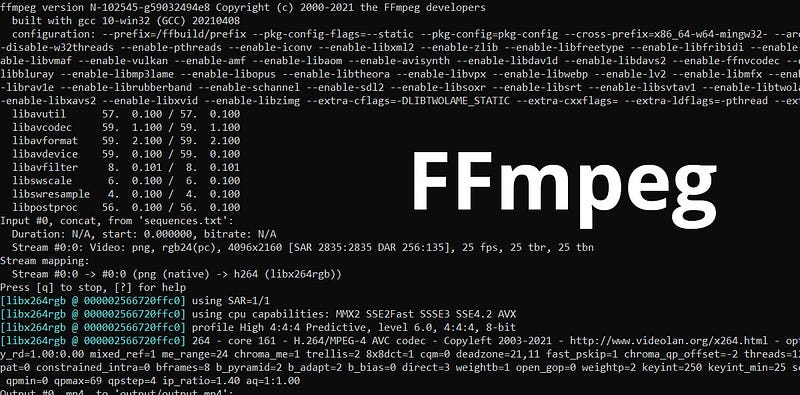

Hey guys, Recently I needed to see how video encoders work, So the first place I look was FFMPEG. This is unarguably the best written encoder with so many features. In this article I will show you how to create a simple video encoder and distribute a encoded video.



What is different than viewing a raw video file and streaming it? The main fallback of raw file viewing is we need to download the whole video to view it in our computer. This is not a good experience when it comes to watching a video. So what streaming does is it sends segments of the video over the internet to us and this gives an instant access to the video.

Now you should understand what we are going to do, We are going to divide our video in to a set of segments and deliver it. So can we do this without encoding? Yes, you can divide a raw video file into segments and deliver them without encoding. This approach is often referred to as “chunked” or “segmented” streaming. It involves breaking down the video file into smaller segments or chunks and then delivering these segments over the internet to be played back by the viewer. Only thing is we need to make sure to follow a suitable protocol to deliver this. There are main 2 types of protocols.

- HTTP Live Streaming (HLS)
- Dynamic Adaptive Streaming over HTTP (DASH)

HLS is used in Apple eco system and DASH is the protocol for the rest.

While encoding is not strictly necessary for this type of streaming, it’s important to note that many streaming platforms still encode the raw video segments to various bitrates and resolutions to accommodate different devices and screen sizes. This is especially important for adaptive streaming, where the player can seamlessly switch between different quality segments based on the viewer’s connection speed and device capabilities.

So in this article I will show you how to create a simple encoder service to encode a simple video in to different bitrates and resolutions to support adaptive streaming. For this I’m going to use fluent-ffmpeg library. Install fluent-ffmpeg using following command.

```bash
npm i fluent-ffmpeg
```

Create file named encoder.js and add the following code.

```javascript
const ffmpegStatic = require('ffmpeg-static');
const ffmpeg = require('fluent-ffmpeg');

ffmpeg.setFfmpegPath(ffmpegStatic);

const inputPath = 'input.mp4';
const outputPath = 'output_dash/output.mpd';
const scaleOptions = ['scale=1280:720', 'scale=640:320'];
const videoCodec = 'libx264';
const x264Options = 'keyint=24:min-keyint=24:no-scenecut';
const videoBitrates = ['1000k', '2000k', '4000k'];

ffmpeg()
  .input(inputPath)
  .videoFilters(scaleOptions)
  .videoCodec(videoCodec)
  .addOption('-x264opts', x264Options)
  .outputOptions('-b:v', videoBitrates[0])
  .format('dash')
  .output(outputPath)
  .on('end', () => {
    console.log('DASH encoding complete.');
  })
  .on('error', (err) => {
    console.error('Error:', err.message);
  })
  .run();
```

Now let’s understand what we have added,

`ffmpeg-static` is a Node.js package that provides static binaries of the FFmpeg multimedia framework. It's used to simplify the process of distributing and running FFmpeg commands within Node.js applications without requiring users to have FFmpeg installed separately on their systems.

Use the `ffmpeg()` function to initiate the FFmpeg command chain. Chain method calls to build the encoding process.

- `.input(inputPath)`: Specifies the input video file.
- `.videoFilters(scaleOptions)`: Applies the specified scale options to the video. This scales the video to the defined resolutions.
- `.videoCodec(videoCodec)`: Sets the video codec to be used. We use libx264, which is H.264 video codec. (H.264/MPEG-4 AVC (Advanced Video Coding) video compression format).
- `.addOption('-x264opts', x264Options)`: Adds the x264 options to the command. (additional settings for the H.264 codec, setting options related to keyframe intervals and scene cuts)
- `.outputOptions('-b:v', videoBitrates[0])`: Sets the bitrate option for the first version of the video. For this tutorial we do only one version
- `.format('dash')`: Specifies the output format as DASH.
- `.output(outputPath)`: Specifies the output path for the DASH manifest.

Now before running the encoder file, make sure to create a folder named output_dash and keep a video file named input.mp4 in the root directory. And run,

```
node encoder.js
```

Now you will get a message DASH encoding complete if everything went well.

Now let’s use data-dashjs-player player to play this video. Create a index.html file and add this,

```
<!DOCTYPE html>
<html lang="en">
<head>
  <meta charset="UTF-8">
  <meta name="viewport" content="width=device-width, initial-scale=1.0">
  <title>DASH Video Player</title>
  <script src="https://cdn.dashjs.org/latest/dash.all.min.js"></script>
</head>
<body>
  <h1>DASH Video Player</h1>
  <div>
    <video data-dashjs-player autoplay controls>
      <source src="output_dash/output.mpd" type="application/dash+xml">
      Your browser does not support the video tag.
    </video>
  </div>
</body>
</html>
```

Now let’s create a simple express js server, Create a file name server.js

```javascript
const express = require('express');
const path = require('path');
const app = express();
const port = 3000;

app.use(express.static('output_dash'));

app.get('/', (req, res) => {
    res.sendFile(path.join(__dirname, 'index.html')); // Replace with your HTML file
  });

app.listen(port, () => {
  console.log(`Server is running at http://localhost:${port}`);
});
```

Now run,

```
node server.js
```

Now go to [http://localhost:3000/](http://localhost:3000/)

You should see the video there. And it will load segment by segment with buffering.

Thank you guys !!! See you in a next article with more advance stuff about video encoding.
